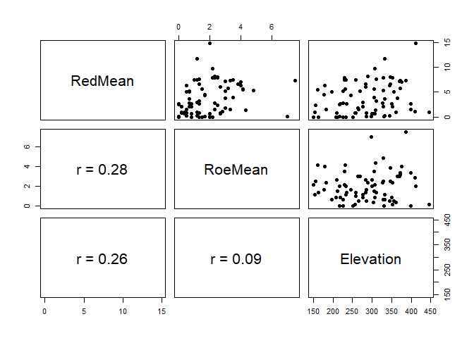

Deer species browsing incidence in coniferous forests of Glen Tanar
================
David Kesner

required package:

``` r
library(ggplot2)
```

## Background

During my MSc at the University of Aberdeen, I undertook an analysis of
ecological data within the Glen Tanar national nature reserve in
northeast Scotland, as part of a GIS course. I was tasked with
investigating the factors influencing the winter browsing incidence of
the woodland and surrounding moorland by deer species (indicated by dung
density) during the years 2000 to 2005. The data was supplied within a
geodatabase containing mean winter dung counts measured along 50x2m
transects for roe (*Capreolus capreolus*) and red deer (*Cervus
elaphus*) respectively, in addition to habitat codes, and a digital
terrain model.

I asked two specific research questions, namely: does winter browsing
incidence (represented by dung density) in conifer-forest sites at Glen
Tanar:

1.  differ between red and roe deer?; and
2.  depend on elevation for red and roe deer respectively?

I investigated these questions using ArcGIS as well as R.

## Question 1

For the first research question, I generated maps visualising the mean
dung densities within conifer-forest sites for the six-year period for
red and roe deer respectively:


The maps show the extent of conifer forests within Glen Tanar as green
polygons, with points showing mean winter dung densities (no.
pellets/50x2m transect) for the six-year period 2000-2005 at 78
locations within conifer forest, for (a) roe and (b) red deer. The
labelled point in (b) shows the transect that had the highest dung
density value among all conifer transects.

It is evident from this map that there is generally a higher dung
density for red deer than for roe deer in conifer habitats at Glen
Tanar. To investigate this quantitatively, I aimed to conduct an
inferential statistical test comparing the means of the two
distributions, namely a t-test. I first imported the data into R:

``` r
#read in deer data
deer <- read.csv("conifer_GTNR.csv")
head(deer)
```

    ##   OBJECTID Transect Easting Northing RedMean RoeMean Elevation
    ## 1        1        4  347590   798120       0    2.16  149.5913
    ## 2        2       14  341620   797780       0    0.83  208.3760
    ## 3        3        3  341140   797830       0    1.50  211.0994
    ## 4        4        6  347090   797960       0    1.33  162.3487
    ## 5        5       21  340660   797450       0    0.00  225.6292
    ## 6        6       19  350960   797500       1    1.16  154.7545

The dataset has columns of mean dung density for red and roe deer, and
an elevation variable.

I then visualised boxplots of the mean dung counts for the two species:

``` r
boxplot(deer$RedMean, deer$RoeMean, names=c("red deer","roe deer"), 
        ylab = "dung density (no. pellets/50x2m transect)", 
        cex.lab=1.2, cex.axis=1.2, ylim = c(0,16), breaks = c(4,8,12))
```

<!-- -->

In agreement with the map, the distribution of red deer dung density
shows that the median red deer dung count is higher than the upper
quartile of the roe deer dung count. Before conducting a t-test, I
checked whether the variables satisfy the assumptions of the test
i.e. that they are normally distributed and have equal variances. Both
variables appear roughly normally distributed, but they do not appear to
have equal variances. As a rule-of-thumb, if the standard deviation of
one variable is 4 times or more than that of the other, the data are
considered heteroscedastic:

``` r
sd(deer$RedMean);sd(deer$RoeMean)
```

    ## [1] 3.206473

    ## [1] 1.512634

The differences in variances are not large enough to conclude that the
data are heteroscedastic, so I proceeded with the t-test. I tested for a
difference (in any direction) between the two distributions with a
two-sided t-test:

``` r
t.test(deer$RedMean, deer$RoeMean, paired = F, alternative = "two.sided")
```

    ## 
    ##  Welch Two Sample t-test
    ## 
    ## data:  deer$RedMean and deer$RoeMean
    ## t = 4.4597, df = 109.65, p-value = 1.994e-05
    ## alternative hypothesis: true difference in means is not equal to 0
    ## 95 percent confidence interval:
    ##  0.994684 2.585829
    ## sample estimates:
    ## mean of x mean of y 
    ##  3.695256  1.905000

The test statistic of 4.46 is statistically significant well below the
1% level. More importantly, the output shows that the effect size of the
mean difference between red and roe deer dung pellets per transect lies
between \~1 and 2.59 with 95% confidence. This is a sizeable amount,
considering that the average number of combined roe and red deer pellets
observed per conifer-forest transect is 5.6. This test has addressed the
first question, supporting the notion that browsing incidence differs
between the two deer species, with red deer browsing more than roe deer
in conifer forests of Glen Tanar.

## Question 2

To address the second question, I investigated whether mean dung
densities in conifer forests depend on elevation for red and roe deer
respectively. I first generated maps visualising the dung densities
against the elevational layout of Glen Tanar:


The maps above show the elevational layout of the full extent of the
nature reserve, with the distribution of conifer forests and mean
2000-2005 winter dung densities overlayed for (a) roe and (b) red deer.
No obvious systematic patterns between dung density and elevation stand
out for either red or roe deer. Nonetheless, there does appear to be
high dung densities at some high-elevation conifer forests in the red
deer map, especially to the south-east of the reserve.

To quantitatively test whether dung density depends on elevation, I used
a simple linear regression model. Before implementing this, it was
necessary to visualise the respective potential relationships among
elevation and the two dung density variables, to identify whether a
linear model is appropriate for the data and whether any data
transformations are needed. First, I checked the distribution of the
elevation variable:

``` r
boxplot(deer$Elevation, ylab = "elevation (m)",cex.lab=1.2, 
        cex.axis=1.2)
```

<!-- -->

It shows an even spread of values across the distribution with no
outliers, so it is unlikely that any transformation of this variable
will be needed.

I then plotted a scatterplot matrix to identify potential relationships
among the variables:

``` r
pairs(deer[,c("RedMean","RoeMean","Elevation")], pch=19)
```

<!-- -->

There appears to be very little covariation between elevation and the
two dung density variables. There does not appear to be any egregious
issues with data spanning orders of magnitude, non-linear relationships,
or heteroscedasticity of the dung density variables across the elevation
variable range, so no transformations were done.

The other assumptions of the linear regression model are addressed by
looking at the diagnostic plots that are outputted with its
implementation.

### Red deer

Before implementing the model on the red deer data, I checked what a
linear relationship between red deer dung densities and elevation would
look like:

``` r
ggplot(deer, aes(Elevation, RedMean))+
  geom_point()+
  geom_smooth(method = "lm")+
  theme(axis.text = element_text(size = 10, color = "black"),
        axis.title = element_text(size=12, color = "black"),
        axis.title.y = element_text(margin = margin(t = 0, r = 20, b = 0, l = 0)),
        axis.title.x = element_text(margin = margin(t = 20, r = 0, b = 0, l = 0)))+
  xlab("elevation (m)")+
  ylab("red deer dung density (no. pellets/50x2m transect)")
```

<!-- -->

There seems to be a definite positive linear relationship, albeit
gradual. In agreement with my initial thoughts after seeing the
scatterplot matrix, there does not appear to be any issues of
heteroscedasticity of residuals around the fitted line, so a linear
model seems appropriate.

I first implemented the linear model and looked at diagnostic plots of
the model. I divided elevation by 10 in order to be able to interpret
the slope coefficient of the model in terms of a 10m unit increase in
elevation, rather than 1m.

``` r
deer$elev.scale <- deer$Elevation/10
red.lm <- lm(RedMean~elev.scale, deer)
par(mfrow = c(2,2), mar = c(2,2,2,2))
plot(red.lm)
```

<!-- -->

There does not appear to be anything egregious in these plots: the
residuals vs fitted plot shows a relatively even spread of residuals
around the fitted line, implying a simple linear model is appropriate
for these data; the residuals appear roughly normal, with the majority
conforming closely to the idealised normal distribution in the Q-Q plot,
although there are some outliers in the bottom right corner which may be
a problem; the scale-location plot shows the residuals are spread quite
evenly and randomly across the range of predictors, implying they
approximate homoscedasticity; the residuals vs leverage informs us that
any outliers in the data don’t have an outsized influence on the
regression results. Overall, it seems reasonable to assume that the
model satisfies all assumptions. I gave the few points in the bottom
right of the Q-Q plot the benefit of the doubt, and went ahead with
interpreting the model output:

``` r
summary(red.lm)
```

    ## 
    ## Call:
    ## lm(formula = RedMean ~ elev.scale, data = deer)
    ## 
    ## Residuals:
    ##    Min     1Q Median     3Q    Max 
    ## -4.554 -2.687 -0.569  2.350  9.667 
    ## 
    ## Coefficients:
    ##             Estimate Std. Error t value Pr(>|t|)  
    ## (Intercept)  0.33178    1.50073   0.221   0.8256  
    ## elev.scale   0.11721    0.05083   2.306   0.0238 *
    ## ---
    ## Signif. codes:  0 '***' 0.001 '**' 0.01 '*' 0.05 '.' 0.1 ' ' 1
    ## 
    ## Residual standard error: 3.12 on 76 degrees of freedom
    ## Multiple R-squared:  0.0654, Adjusted R-squared:  0.0531 
    ## F-statistic: 5.318 on 1 and 76 DF,  p-value: 0.02384

and the confidence interval around the slope coefficient:

``` r
confint(red.lm, 'elev.scale', level=0.95)
```

    ##                 2.5 %    97.5 %
    ## elev.scale 0.01597831 0.2184424

The output shows that the intercept estimate of 0.33 means that there
are 0.33 red deer dung pellets within the average transect at 0
elevation - this is not really informative because it extrapolates past
the elevational range and outside of the nature reserve!

The slope coefficient of the elevation variable indicates that red deer
dung density increases by an average of 0.12 pellets/transect with a 10m
increase in elevation. The 95% confidence interval of this estimate has
a lower bound above 0, and the test statistic of 2.3 is significant at
the 5% level, suggesting that this relationship is real. However, the
adjusted R-squared shows that elevation explains only about 5% of the
overall variation in red deer dung density, so elevation is a very weak
predictor of red deer browsing incidence! There are probably multiple
other factors that determine where red deer prefer to browse.

## Question 2

### Roe deer

To complete the analysis for question 2, the same linear regression
procedure followed for red deer above was applied to the roe deer data,
first visualising a hypothetical linear model between roe deer dung
density and elevation:

``` r
ggplot(deer, aes(Elevation, RoeMean))+
  geom_point()+
  geom_smooth(method = "lm")+
  theme(axis.text = element_text(size = 10, color = "black"),
        axis.title = element_text(size=12, color = "black"),
        axis.title.y = element_text(margin = margin(t = 0, r = 20, b = 0, l = 0)),
        axis.title.x = element_text(margin = margin(t = 20, r = 0, b = 0, l = 0)))+
  xlab("elevation (m)")+
  ylab("roe deer dung density (no. pellets/50x2m transect)")
```

<!-- -->

There appears to be very little association between the two variables.
We might expect that the linear model will reflect this:

``` r
roe.lm <- lm(RoeMean~elev.scale, deer)
par(mfrow = c(2,2), mar = c(2,2,2,2))
plot(roe.lm)
```

<!-- -->

The roe deer data appear to satisfy the assumptions of the model
reasonably well, although the Q-Q plot again shows some questionable
features - the observations in the bottom left as well as the two
points17 and 51 in the top right. Again, I decided to give the data the
benefit of the doubt and proceed with interpreting the regression model:

``` r
summary(roe.lm)
```

    ## 
    ## Call:
    ## lm(formula = RoeMean ~ elev.scale, data = deer)
    ## 
    ## Residuals:
    ##     Min      1Q  Median      3Q     Max 
    ## -2.1179 -1.1241 -0.2517  0.8240  5.4041 
    ## 
    ## Coefficients:
    ##             Estimate Std. Error t value Pr(>|t|)  
    ## (Intercept)  1.35702    0.72945   1.860   0.0667 .
    ## elev.scale   0.01910    0.02471   0.773   0.4420  
    ## ---
    ## Signif. codes:  0 '***' 0.001 '**' 0.01 '*' 0.05 '.' 0.1 ' ' 1
    ## 
    ## Residual standard error: 1.517 on 76 degrees of freedom
    ## Multiple R-squared:  0.0078, Adjusted R-squared:  -0.005255 
    ## F-statistic: 0.5974 on 1 and 76 DF,  p-value: 0.442

``` r
confint(roe.lm, 'elev.scale', level=0.95)
```

    ##                  2.5 %     97.5 %
    ## elev.scale -0.03010916 0.06830098

As expected, there is no clear pattern between elevation and roe deer
dung density. The variation explained by this model is below 1%, and the
95% confidence interval of the elevation slope coefficient spans 0. From
this, it seems clear that roe deer show no elevational preferences in
where they browse.

In summary, this analysis reveals some important deer browsing
characteristics within coniferous habitats of Glen Tanar during winter,
that could be useful for managers of Glen Tanar towards effectively
allocating resources to the maintenance of conifer forests in the
reserve. The results suggest that red deer browse more heavily than roe
deer, and that red deer generally prefer to browse at higher elevation
conifer forests, though elevation is probably a minor factor informing
where red deer prefer to browse. Roe deer show no elevational
preferences in conifer-forest browsing.
