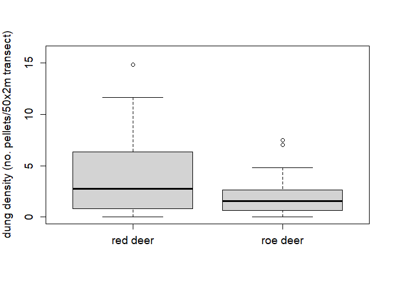

Deer species browsing incidence in coniferous forests of Glen Tanar
nature reserve
================
David Kesner

required package:

``` r
library(ggplot2)
```

## Background

As part of a GIS course I undertook during my MSc at the University of
Aberdeen, I conducted an analysis of ecological data collected from the
Glen Tanar national nature reserve in northeast Scotland. I was tasked
with investigating the factors influencing the winter browsing incidence
of deer species (indicated by dung density) within the reserve for the
years 2000 to 2005. The data was supplied within a geodatabase
containing mean winter dung pellet counts measured along 50x2m transects
for roe (*Capreolus capreolus*) and red deer (*Cervus elaphus*)
respectively, in addition to habitat codes and a digital terrain model.

I formulated two research questions: does winter browsing incidence in
conifer-forest sites at Glen Tanar:

1.  differ between red and roe deer? and
2.  depend on elevation for red and roe deer respectively?

I investigated these questions using ArcGIS and R.

## Question 1

For the first research question, I generated maps in ArcGIS, visualising
the mean dung densities within conifer-forest sites for the six-year
period for red and roe deer respectively:


The maps show the extent of the Glen Tanar conifer forests as green
polygons, with points showing mean winter dung densities (no.
pellets/50x2m transect) for 2000-2005 at 78 locations for (a) roe and
(b) red deer. The labelled point in (b) shows the transect that had the
highest mean dung density value among all conifer-forest transects.

The maps indicate that there is generally a higher dung density for red
deer than for roe deer across the study site. To investigate this
quantitatively, I compared the mean dung densities of the two species
using a t-test. I first imported the data into R:

``` r
#read in deer data
deer <- read.csv("conifer_GTNR.csv")
head(deer)
```

    ##   OBJECTID Transect Easting Northing RedMean RoeMean Elevation
    ## 1        1        4  347590   798120       0    2.16  149.5913
    ## 2        2       14  341620   797780       0    0.83  208.3760
    ## 3        3        3  341140   797830       0    1.50  211.0994
    ## 4        4        6  347090   797960       0    1.33  162.3487
    ## 5        5       21  340660   797450       0    0.00  225.6292
    ## 6        6       19  350960   797500       1    1.16  154.7545

The `RedMean` and `RoeMean` columns contain the dung densities for for
red and roe deer. I then visualised these variables by plotting their
distributions as boxplots:

``` r
boxplot(deer$RedMean, deer$RoeMean, names=c("red deer","roe deer"), 
        ylab = "dung density (no. pellets/50x2m transect)", 
        cex.lab=1.2, cex.axis=1.2, ylim = c(0,16))
```

<!-- -->

In agreement with the maps, the boxplots indicate that red deer dung
densities are higher than for roe deer. This can be seen by the median
red deer dung density being higher than the upper quartile of the roe
deer distribution.

Before conducting the t-test, I considered whether the variables satisfy
the assumptions of the test, namely that they are normally distributed
and have equal variances. Looking at the boxplots, both variables appear
roughly normally distributed, but they do not appear to have equal
variances (homoscedasticity). As a rule-of-thumb, if the standard
deviation of one variable is 4 times or more than that of the other, the
data are considered heteroscedastic:

``` r
sd(deer$RedMean);sd(deer$RoeMean)
```

    ## [1] 3.206473

    ## [1] 1.512634

The differences in standard deviations are not large enough to conclude
that the data are heteroscedastic, so I proceeded with the t-test. I
tested for a difference in means in any direction using a two-sided
t-test:

``` r
t.test(deer$RedMean, deer$RoeMean, paired = F, alternative = "two.sided")
```

    ## 
    ##  Welch Two Sample t-test
    ## 
    ## data:  deer$RedMean and deer$RoeMean
    ## t = 4.4597, df = 109.65, p-value = 1.994e-05
    ## alternative hypothesis: true difference in means is not equal to 0
    ## 95 percent confidence interval:
    ##  0.994684 2.585829
    ## sample estimates:
    ## mean of x mean of y 
    ##  3.695256  1.905000

The effect size of the mean difference between red and roe deer dung
pellets per transect lies between \~1 and 2.59 with 95% confidence. This
is a sizeable amount, considering that the average number of combined
roe and red deer pellets observed per conifer-forest transect is 5.6.
The test statistic of 4.46 is statistically significant, well below the
1% level. This test has addressed the first question, supporting that
browsing incidence differs between the two deer species, with red deer
showing higher winter browsing incidence than roe deer in the conifer
forests of Glen Tanar.

## Question 2

To address the second question, I first generated maps in ArcGIS,
visualising the dung densities against the elevational layout of Glen
Tanar:


The maps show the elevational layout of the full extent of the nature
reserve, with the distribution of conifer forests and mean 2000-2005
winter dung densities overlayed, for (a) roe and (b) red deer. No
obvious systematic patterns between dung density and elevation stand out
for either red or roe deer. Nonetheless, there does appear to be high
dung densities at some high-elevation conifer forests in the red deer
map, especially to the south-east of the reserve.

To quantitatively test whether dung density depends on elevation, I used
a simple linear regression modelling approach. Before implementing this,
I explored the data, first by checking the distribution of the elevation
variable:

``` r
boxplot(deer$Elevation, ylab = "elevation (m)",cex.lab=1.2, cex.axis=1.2)
```

<!-- -->

It shows an even spread of values with no outliers, so it is unlikely
that any transformation of this variable will be needed.

I then visualised the dung density distributions against elevation using
a scatterplot matrix, to identify whether a linear model is appropriate
for the data and whether any data transformations are needed. I added
the correlation values among the variables for insight into any linear
relationships that might exist. Doing this using the `pairs` function
requires writing a separate correlation function for it’s `lower.panel`
argument:

``` r
panel.cor <- function(x, y){
    usr <- par("usr"); on.exit(par(usr))
    par(usr = c(0, 1, 0, 1))
    r <- round(cor(x, y), digits=2)
    txt <- paste0("r = ", r)
    text(0.5, 0.5, txt, cex = 2)
}

#point aesthetics
upper.panel<-function(x, y){
  points(x,y, pch = 19)
}

#plot
pairs(deer[,c("RedMean","RoeMean","Elevation")], lower.panel = panel.cor,
      upper.panel = upper.panel)
```

<!-- -->

The data does not appear to have any major issues necessitating data
transformations, like outliers spanning orders of magnitude, non-linear
relationships, or heteroscedasticity of the dung density variables
across the range of the elevation variable, so no transformations were
done. However, there seems to be very little covariation between
elevation and the two dung density variables, with perhaps a weak
relationship existing between elevation and red deer dung density.

### Red deer

Before conducting the linear regression on the red deer data, I looked
more closely at what a linear model between this variable and elevation
would look like:

``` r
ggplot(deer, aes(Elevation, RedMean))+
  geom_point()+
  geom_smooth(method = "lm")+
  theme(axis.text = element_text(size = 10, color = "black"),
        axis.title = element_text(size=12, color = "black"),
        axis.title.y = element_text(margin = margin(t = 0, r = 20, b = 0, l = 0)),
        axis.title.x = element_text(margin = margin(t = 20, r = 0, b = 0, l = 0)))+
  xlab("elevation (m)")+
  ylab("red deer dung density (no. pellets/50x2m transect)")
```

<!-- -->

There seems to be a gradual positive linear relationship. Again, there
does not appear to be any issues of heteroscedasticity of residuals
around the fitted line, so a linear model seems appropriate.

I then looked more closely at whether the assumptions of a linear model
on these data are satisfied, by implementing the model in R and
investigating the diagnostic plots. I first divided the elevation
variable by 10, in order to be able to interpret the slope coefficient
of the model in terms of a 10m unit increase in elevation:

``` r
#scale elevation
deer$elev.scale <- deer$Elevation/10

#run model
red.lm <- lm(RedMean~elev.scale, deer)

#plot
par(mfrow = c(2,2), mar = c(2,2,2,2))
plot(red.lm)
```

<!-- -->

There does not appear to be anything egregious in these plots: the
residuals vs fitted plot shows a relatively even spread of residuals
around the fitted line, implying a linear model is appropriate for these
data; the residuals appear roughly normally distributed, with the
majority conforming closely to the idealised normal distribution in the
Q-Q plot, although there are some outliers in the bottom-right corner;
the scale-location plot shows that the residuals are spread quite evenly
and randomly across the range of the predictor, implying that they
approximate homoscedasticity; and the residuals vs leverage plot
suggests that any outliers in the data don’t have an outsized influence
on the regression results. Overall, it seems reasonable to assume that
the model satisfies all assumptions. I gave the few points in the bottom
right of the Q-Q plot the benefit of the doubt, and went ahead with
interpreting the model output:

``` r
summary(red.lm)
```

    ## 
    ## Call:
    ## lm(formula = RedMean ~ elev.scale, data = deer)
    ## 
    ## Residuals:
    ##    Min     1Q Median     3Q    Max 
    ## -4.554 -2.687 -0.569  2.350  9.667 
    ## 
    ## Coefficients:
    ##             Estimate Std. Error t value Pr(>|t|)  
    ## (Intercept)  0.33178    1.50073   0.221   0.8256  
    ## elev.scale   0.11721    0.05083   2.306   0.0238 *
    ## ---
    ## Signif. codes:  0 '***' 0.001 '**' 0.01 '*' 0.05 '.' 0.1 ' ' 1
    ## 
    ## Residual standard error: 3.12 on 76 degrees of freedom
    ## Multiple R-squared:  0.0654, Adjusted R-squared:  0.0531 
    ## F-statistic: 5.318 on 1 and 76 DF,  p-value: 0.02384

And the confidence interval around the slope coefficient:

``` r
confint(red.lm, 'elev.scale', level=0.95)
```

    ##                 2.5 %    97.5 %
    ## elev.scale 0.01597831 0.2184424

The slope coefficient of the elevation variable indicates that red deer
dung density increases by an average of 0.12 pellets/transect when
elevation increases by 10m. This is a relatively modest amount,
considering that all but one of the transects fall within an elevational
range of \~300m, and the interquartile range of the red deer dung
density variable is \~5.5. If traversing the \~300m elevational range,
the average increase in red deer dung pellets/transect is \~3.6, about
two thirds of the dung density interquartile range. The 95% confidence
interval of this estimate has a lower bound above 0 and the test
statistic of 2.3 is significant at the 5% level, suggesting that this
relationship is robust. However, the adjusted R-squared value indicates
that elevation explains only about 5% of the overall variation in red
deer dung density, suggesting that elevation has very low importance for
predicting red deer browsing incidence. There are likely to be multiple
other factors that influence where red deer prefer to browse.

### Roe deer

To complete the analysis for question 2, I applied the same linear
regression procedure above to the roe deer data. Once again, I first
visualised the linear relationship between dung density and elevation:

``` r
ggplot(deer, aes(Elevation, RoeMean))+
  geom_point()+
  geom_smooth(method = "lm")+
  theme(axis.text = element_text(size = 10, color = "black"),
        axis.title = element_text(size=12, color = "black"),
        axis.title.y = element_text(margin = margin(t = 0, r = 20, b = 0, l = 0)),
        axis.title.x = element_text(margin = margin(t = 20, r = 0, b = 0, l = 0)))+
  xlab("elevation (m)")+
  ylab("roe deer dung density (no. pellets/50x2m transect)")
```

<!-- -->

In agreement with the scatterplot matrix, there appears to be a
negligible association between the two variables. We can expect that the
linear model will reflect this:

``` r
roe.lm <- lm(RoeMean~elev.scale, deer)
par(mfrow = c(2,2), mar = c(2,2,2,2))
plot(roe.lm)
```

<!-- -->

The roe deer data appear to satisfy the assumptions of the model
reasonably well, although the Q-Q plot once again shows some
questionable features - the observations in the bottom left as well as
the two points 17 and 51 in the top right of the plot. Again, I decided
to give the data the benefit of the doubt, and proceed with interpreting
the model:

``` r
summary(roe.lm)
```

    ## 
    ## Call:
    ## lm(formula = RoeMean ~ elev.scale, data = deer)
    ## 
    ## Residuals:
    ##     Min      1Q  Median      3Q     Max 
    ## -2.1179 -1.1241 -0.2517  0.8240  5.4041 
    ## 
    ## Coefficients:
    ##             Estimate Std. Error t value Pr(>|t|)  
    ## (Intercept)  1.35702    0.72945   1.860   0.0667 .
    ## elev.scale   0.01910    0.02471   0.773   0.4420  
    ## ---
    ## Signif. codes:  0 '***' 0.001 '**' 0.01 '*' 0.05 '.' 0.1 ' ' 1
    ## 
    ## Residual standard error: 1.517 on 76 degrees of freedom
    ## Multiple R-squared:  0.0078, Adjusted R-squared:  -0.005255 
    ## F-statistic: 0.5974 on 1 and 76 DF,  p-value: 0.442

``` r
confint(roe.lm, 'elev.scale', level=0.95)
```

    ##                  2.5 %     97.5 %
    ## elev.scale -0.03010916 0.06830098

As expected, there is no evidence for a relationship between elevation
and roe deer dung density. The variation explained by this model is
below 1%, and the 95% confidence interval of the slope coefficient spans
0. This suggests that roe deer show no elevational preferences in where
they browse.

In summary, this analysis reveals some important features of winter deer
browsing incidence within coniferous habitats of Glen Tanar, that can be
useful towards effective management of conifer forests in the reserve.
The analysis indicates that red deer browse more heavily than roe deer,
with red deer showing a weak preference for browsing at higher
elevations, although there are likely to be far more important factors
than elevation informing red deer browsing preferences which remain
unidentified.
